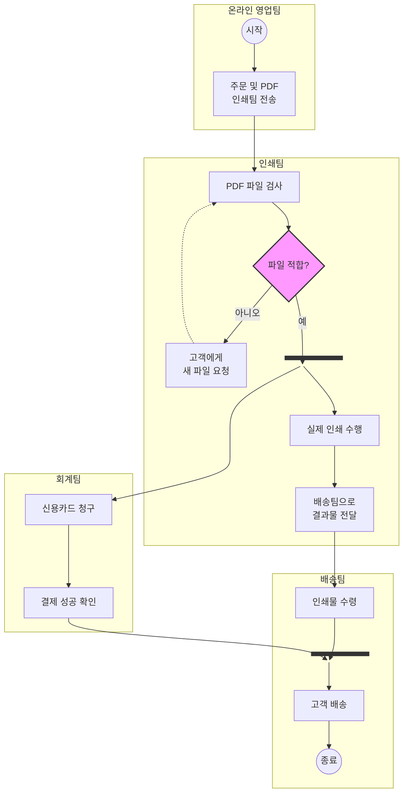

```mermaid
flowchart TD
    %% 스타일 정의: 동기화 막대(Fork/Join)를 굵은 선으로 표현
    classDef sync fill:#333,stroke:#333,stroke-width:4px,height:4px,width:100px;
    classDef decision fill:#f9f,stroke:#333,stroke-width:2px;
    
    %% 1. 온라인 영업팀 레인
    subgraph Sales [온라인 영업팀]
        direction TB
        Start((시작)) --> SendOrder[주문 및 PDF<br/>인쇄팀 전송]
    end

    %% 2. 인쇄팀 레인
    subgraph Printing [인쇄팀]
        direction TB
        SendOrder --> CheckPDF[PDF 파일 검사]
        CheckPDF --> IsValid{파일 적합?}
        
        %% 루프 (부적합 시)
        IsValid -- 아니오 --> RequestNew[고객에게<br/>새 파일 요청]
        RequestNew -.-> CheckPDF
        
        %% 분기 (Fork)
        IsValid -- 예 --> ForkNode[ ]:::sync
        
        ForkNode --> DoPrint[실제 인쇄 수행]
        DoPrint --> SendProduct[배송팀으로<br/>결과물 전달]
    end

    %% 3. 회계팀 레인
    subgraph Accounting [회계팀]
        direction TB
        ForkNode --> ChargeCard[신용카드 청구]
        ChargeCard --> ConfirmPay[결제 성공 확인]
    end

    %% 4. 배송팀 레인
    subgraph Shipping [배송팀]
        direction TB
        SendProduct --> ReceiveProd[인쇄물 수령]
        
        %% 결합 (Join)
        ReceiveProd --> JoinNode[ ]:::sync
        ConfirmPay --> JoinNode
        
        JoinNode --> Deliver[고객 배송]
        Deliver --> EndNode((종료))
    end

    %% 스타일 적용 (마름모)
    class IsValid decision
```
